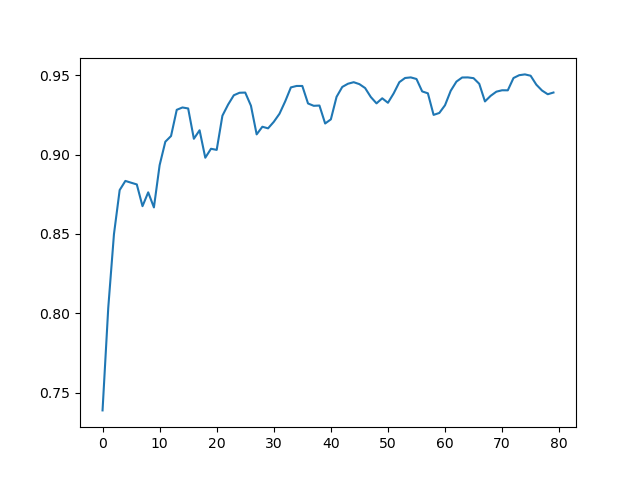
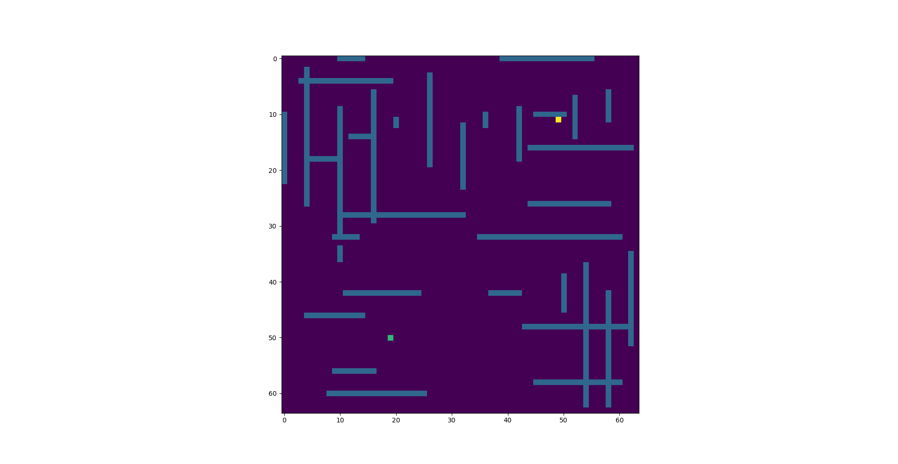
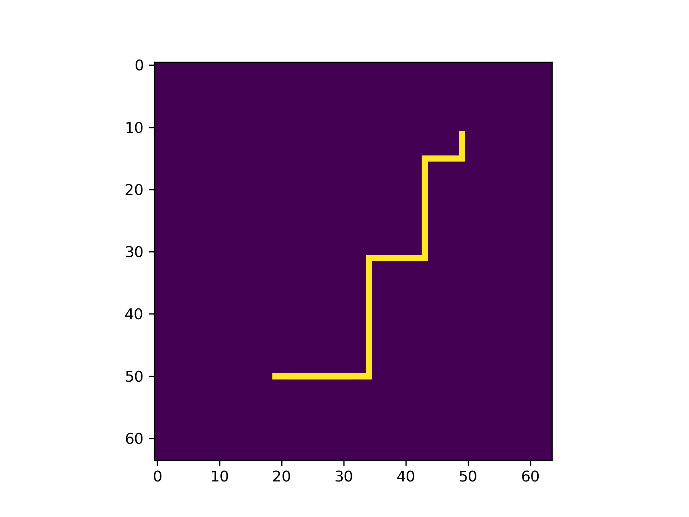

# Neural Network for Lee Algorithm

## Table of Contents
* [General Info](#general-information)
* [Technologies Used](#technologies-used)
* [Features](#features)
* [Screenshots](#screenshots)
* [Performance](#performance)
* [Setup and usage](#setup-and-usage)
* [Room for Improvement](#room-for-improvement)
* [Contact](#contact)

## General Information
- This project is created to train a neural network based on a generated dataset that takes two combined rain matrices (to roughly emulate how a proper chip layout would look like) and uses Lee Algorithm to make one route (if it exists) for each one of them
- Goal of this project is to see if a trained neural network can improve the speed of Lee Algorithm with minimal amount of defects

## Technologies Used
- Anaconda
- Python 3.10
- PyTorch 1.13.0
- Pandas
- NumPy
- Scikit-learn

## Features
- The ability to generate datasets with different parameters
- Trained model can be saved and exported
- Performance of the algorithm and trained model can be measured and compared
- Support for creating images on different stages of the process to help with visualisation of data

## Screenshots

  

 Accuracy plot 

  

 Source matrix example 

  

 Prediction example 

## Performance

 The difference in speed is obvious even on a reasonably small dataset 

 Plotting routes with Lee Algorithm for a dataset with 1000 elements took 40 seconds 

 Plotting routes for the same dataset, but with trained model only took 3 seconds 

 It's more than 13 times faster 

## Setup and usage
Requirements are listed under  [Technologies Used](#technologies-used)

To start using the project you will need to:
1. Download whole repository
2. If needed, uncomment parts of code that are used for saving images
3. Open anaconda terminal in the main folder
4. Generate the dataset via autogen.py
5. Train the neural network via nn.py
6. Best model checkpoint data will be saved in a .pth file which can be used for testing in saved_model_test.py

## Room for Improvement
I feel that with enough time and patience model accuracy can be improved a bit, also adding support for batches in validation to generate images faster would be nice

# Contact
Created by [PerrySquared](https://github.com/PerrySquared)
